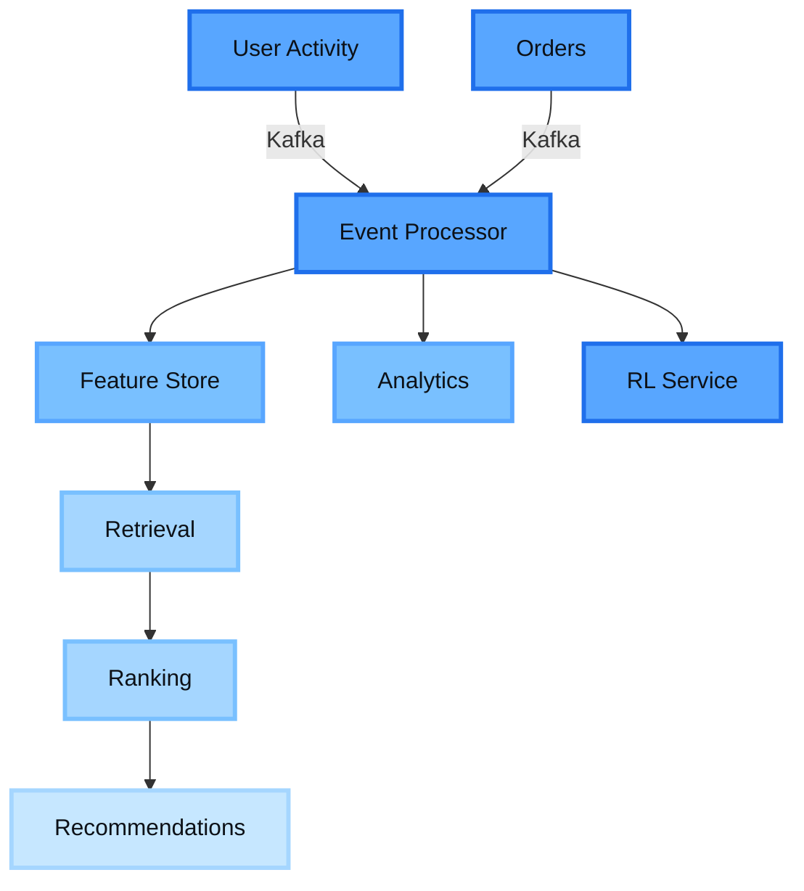

<div align="center">


</div>

<p align="center">
  <a href="https://www.linkedin.com/in/theparidhisharma/">
    
  </a>
  <a href="mailto:paridhi0203sharma@gmail.com">
    
  </a>
  <a href="https://cresia.in">
    
  </a>
  <a href="https://justmywritesblog.wordpress.com/">
    
  </a>
</p>

<p align="center">
  
  
  
</p>

<br/>

<table>
<tr>
<td width="50%" valign="top">

## 🎯 About Me

```typescript
const paridhi = {
  role: "Co-Founder & Engineer @ Cresia",
  education: "B.Tech CSE @ IGDTUW",
  previousRole: "Backend Intern @ Deutsche Telekom",
  
  expertise: {
    backend: ["Kafka", "Microservices", "Spring Boot"],
    frontend: ["React", "TypeScript", "Modern UI/UX"],
    systems: ["Distributed Systems", "Event-Driven Design"]
  },
  
  philosophy: "Build systems, not demos. Ship fast, iterate faster."
};
```

### 💡 What I Do

🔹 **Architect** production-grade distributed systems  
🔹 **Build** scalable microservices with Kafka  
🔹 **Design** event-driven architectures that scale  
🔹 **Ship** real products used by real people  

</td>
<td width="50%" valign="top">


</td>
</tr>
</table>

<br/>


<h1 align="center">
  
</h1>


<br/><br/>

<div align="center">

##  RetargetIQ — Event-Driven Powerhouse

[](https://github.com/theparidhisharma/RetargetIQ)
[](https://github.com/theparidhisharma/RetargetIQ)
[](https://github.com/theparidhisharma/RetargetIQ)
[](https://github.com/theparidhisharma/RetargetIQ)
[](https://github.com/theparidhisharma/RetargetIQ)

</div>

<table>
<tr>
<td width="60%" valign="top">

### 🚀 The System

A **production-scale distributed system** with **10+ microservices** orchestrated through Apache Kafka. Built to simulate real-world retargeting architectures used by companies like **LinkedIn**, **Uber**, and **Netflix**.

This isn't a portfolio project — it's a **distributed systems masterclass**.

### ⚡ Key Features

- **Event-Driven Architecture** → Services communicate asynchronously via Kafka
- **Complete Decoupling** → Pure pub-sub model, zero inter-service dependencies
- **Production-Ready** → Docker orchestration, comprehensive logging, error handling
- **Real-World Pipeline** → Feature extraction → Retrieval → Ranking → Recommendations
- **Scalable Design** → Built to handle thousands of events per second

### 💎 Why It Matters

This is what happens when you combine backend expertise with systems thinking. Every service is independently deployable, every component is testable, and the entire system is built to scale.

</td>
<td width="40%" valign="top">



**Stack**: Java • Spring Boot • Apache Kafka • Docker • Microservices

</td>
</tr>
</table>

<br/>


<br/><br/>

<div align="center">

##  SehatAI — AI Health Intelligence Platform

[](https://github.com/TheNandinee/SehatAI)

[](https://github.com/TheNandinee/SehatAI)
[](https://github.com/TheNandinee/SehatAI)
[](https://github.com/TheNandinee/SehatAI)

</div>

<table>
<tr>
<td width="50%" valign="top">

### 🎯 Complete Ownership

**Frontend Engineering**
- Designed & built entire UI from scratch
- Component-driven React architecture
- Modern, accessible healthcare interface
- Responsive across all devices

**Backend Architecture**
- REST API design & implementation
- Service orchestration layer
- Clean LLM/RAG integration
- Production-ready deployment

</td>
<td width="50%" valign="top">

### ✨ Engineering Excellence

**Clean Architecture**  
Proper service boundaries where ML layer integrates without creating a monolith.

**Separation of Concerns**  
Frontend ↔ Backend ↔ AI layers completely decoupled.

**Production Focus**  
Built for real users, not demo days.

> *Proof that AI integration doesn't have to be messy.*

**Stack**: TypeScript • React • Node.js • AI/ML • Clean Architecture

</td>
</tr>
</table>

<br/>


<br/><br/>

<div align="center">

##  RAVEN — Constraint Reasoning Engine

[](https://github.com/theparidhisharma/RAVEN-KDSH-2026)
[](https://github.com/theparidhisharma/RAVEN-KDSH-2026)
[](https://github.com/theparidhisharma/RAVEN-KDSH-2026)

</div>

<br/>

<table>
<tr>
<td width="55%" valign="top">

### 🧠 The Challenge

**Can machines understand stories well enough to solve logic puzzles?**

RAVEN says **yes**.

### ⚙️ How It Works

```
Natural Language → Parse → Extract Constraints → Solve Logic → Solution
```

### 🎯 Capabilities

- Converts natural language narratives into logical constraints
- Solves multi-variable constraint satisfaction problems
- Makes deductions based on implicit information
- Handles complex reasoning chains

</td>
<td width="45%" valign="top">

<br/>

> *"When you need Sherlock Holmes but in code form."*

<br/>

**Technology Stack**

Python • NLP • Constraint Solving • Logic Programming

<br/>

**Use Cases**

✓ Logic puzzle solving  
✓ Constraint satisfaction  
✓ Automated reasoning  
✓ Natural language understanding

</td>
</tr>
</table>

<br/>


<br/>

<details>
<summary><b>📊 More Projects → Click to Expand</b></summary>

<br/>

### Trader Sentiment Analysis — Fear vs Greed Study

[](https://github.com/theparidhisharma/trader-sentiment-analysis)

Research exploring how emotional sentiment impacts trader profitability.

**Stack**: Python • Data Science • Behavioral Finance

---

### Student Portal — Modern Dashboard

[](https://student-portal-navy-six.vercel.app/)
[](https://github.com/theparidhisharma/Student-Portal)

Clean, responsive dashboard with theme switching and modern UI patterns.

**Stack**: React • Tailwind CSS • JavaScript

---

### ATS GradeIT — Resume Intelligence

[](https://github.com/theparidhisharma/ATS-GradeIT)

NLP-powered resume parser and job-fit scoring system.

**Stack**: Python • NLP • Machine Learning

---

### Vibe Matcher — Fashion AI

[](https://github.com/theparidhisharma/Vibe_Matcher_Recommender)

Tell me your vibe, I'll find your outfit. Lightweight AI using text embeddings.

**Stack**: Python • Text Embeddings • Cosine Similarity

</details>

<br/>


<h2 align="center">⚡ Tech Stack</h2>

<p align="center">
  
</p>

<br/>

<table align="center">
<tr>
<td align="center" width="33%">

### 🔧 Backend


</td>
<td align="center" width="33%">

### 🎨 Frontend


</td>
<td align="center" width="33%">

### 🚀 DevOps & Tools


</td>
</tr>
</table>

<br/>


<h2 align="center">📊 GitHub Stats</h2>

<p align="center">
  
  
</p>

<p align="center">
  
  
</p>

<br/>


<h2 align="center">💼 Experience</h2>

<table>
<tr>
<td width="50%" valign="top">

### ✨ Cresia — Co-Founder & Engineer

**Building production systems that power real businesses**

```yaml
role: Complete system architecture
scope: Database → Deployment
impact: Real users, real constraints
learning: Production ≠ tutorials
```

[](https://cresia.in)

</td>
<td width="50%" valign="top">

### ✨ Deutsche Telekom Digital Labs

**Backend Engineering Intern**

**Enterprise-scale distributed systems**

```yaml
tech: Kafka, Microservices
scale: Production-grade systems
learning: Logs matter, simplicity wins
```

</td>
</tr>
</table>

<br/>


<h2 align="center">💭 Engineering Philosophy</h2>

<table align="center">
<tr>
<td align="center" width="33%">

### 🎯 Simple > Clever
Code that's too clever  
is code nobody maintains

</td>
<td align="center" width="33%">

### 📝 Logs > Guesses
If it's not logged,  
it didn't happen

</td>
<td align="center" width="33%">

### 🚀 Ship Fast
Perfect code never ships.  
Good code improves.

</td>
</tr>
<tr>
<td align="center" width="33%">

### 💥 Design for Failure
Everything breaks.  
Plan for it.

</td>
<td align="center" width="33%">

### ✨ Production is Truth
All other environments  
are fantasy

</td>
<td align="center" width="33%">

### 🧩 Build Systems
Not demos.  
Not features. Systems.

</td>
</tr>
</table>

<br/>


<div align="center">

## 🐍 Contribution Graph


</div>

<br/>


<h2 align="center">📬 Let's Connect</h2>

<p align="center">
  <a href="https://www.linkedin.com/in/theparidhisharma/">
    
  </a>
  <a href="mailto:paridhi0203sharma@gmail.com">
    
  </a>
  <a href="https://cresia.in">
    
  </a>
  <a href="https://justmywritesblog.wordpress.com/">
    
  </a>
</p>

<div align="center">

### 💬 Open to discuss

**System Architecture** • **Event-Driven Design** • **Microservices** • **Building for Scale**

### 🚫 Not interested in

"Build my app for exposure" • Tutorial projects • Ideas without depth

</div>

<br/>


<div align="center">

### ✨ *Building systems that scale, one Kafka topic at a time* ✨

<br/>


</div>
