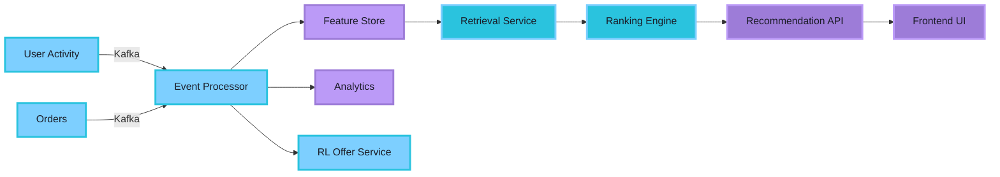

<p align="center">
  
</p>

<p align="center">
  
</p>

<p align="center">
  <a href="https://www.linkedin.com/in/theparidhisharma/"></a>
  <a href="mailto:paridhi0203sharma@gmail.com"></a>
  <a href="https://cresia.in"></a>
  <a href="https://justmywritesblog.wordpress.com/"></a>
</p>

<p align="center">
  
  
  
</p>

<br/>


## 🌟 About Me

**Backend Engineer** who architects systems that don't break under pressure  
**Full-Stack Developer** with end-to-end product ownership  
**System Designer** turning complex problems into elegant solutions

```yaml
current_role: "Co-Founder & Lead Engineer @ Cresia"
education: "B.Tech CSE @ IGDTUW"
previous: "Backend Intern @ Deutsche Telekom Digital Labs"

expertise:
  backend: ["Kafka", "Microservices", "Event-Driven Architecture", "Spring Boot"]
  frontend: ["React", "TypeScript", "Modern UI/UX"]
  systems: ["Distributed Systems", "Production Scale", "Clean Architecture"]

philosophy: "Build systems, not demos. Design for failure. Ship and iterate."
```

<br clear="right"/>

<div align="center">
  
### ━━━━━━━━━━━━━━━━━━━━━━━━━━━━━━━━━━━━━━━━━━━━━━━━━━━━━

</div>

<h1 align="center">
  
</h1>

<div align="center">
  
### ━━━━━━━━━━━━━━━━━━━━━━━━━━━━━━━━━━━━━━━━━━━━━━━━━━━━━

</div>

<br/>

##  RetargetIQ — Event-Driven Powerhouse

<div align="center">
  <a href="https://github.com/theparidhisharma/RetargetIQ">
    
  </a>
  <br/><br/>
  
</div>

<br/>

**A production-scale distributed system with 10+ microservices orchestrated through Apache Kafka**

Built to simulate real-world retargeting architectures used by companies like LinkedIn, Uber, and Netflix. This isn't a portfolio project—it's a distributed systems masterclass.

### 🔥 Architecture Flow



### ✨ What Makes It Special

- **Event-Driven Architecture**: Services communicate asynchronously through Kafka topics
- **Complete Decoupling**: Microservices don't know each other exist—pure pub-sub model
- **Production-Ready**: Docker Compose orchestration, proper logging, error handling
- **Real-World Pipeline**: Feature extraction → Retrieval → Ranking → Recommendations
- **Scalable Design**: Built to handle thousands of events per second

> *This is what happens when you combine backend expertise with systems thinking.*

**Tech Stack**: Java • Spring Boot • Apache Kafka • Docker • Microservices • Event Streaming

<br/>

<div align="center">
  
### ━━━━━━━━━━━━━━━━━━━━━━━━━━━━━━━━━━━━━━━━━━━━━━━━━━━━━

</div>

<br/>

##  SehatAI — AI Health Intelligence Platform

<div align="center">
  <a href="https://github.com/TheNandinee/SehatAI">
    
  </a>
  
  <br/><br/>
  
</div>

<br/>

**Full-stack AI-powered healthcare platform where I owned the entire product engineering**

### 🎯 My Role — Complete Ownership

<table>
<tr>
<td width="50%">

**Frontend Engineering**
- Designed & built entire UI from scratch
- Component-driven React architecture
- Modern, accessible healthcare interface
- Responsive across all devices

</td>
<td width="50%">

**Backend Architecture**
- REST API design & implementation
- Service orchestration layer
- Clean LLM/RAG integration
- Production-ready deployment

</td>
</tr>
</table>

### 💫 Engineering Excellence

**Clean Architecture**: Proper service boundaries where ML layer integrates without creating a monolith  
**Separation of Concerns**: Frontend ↔ Backend ↔ AI layers are completely decoupled  
**Production Focus**: Built for real users, not demo days

> *Proof that AI integration doesn't have to be messy.*

**Tech Stack**: TypeScript • React • Node.js • AI/ML Integration • Clean Architecture

<br/>

<div align="center">
  
### ━━━━━━━━━━━━━━━━━━━━━━━━━━━━━━━━━━━━━━━━━━━━━━━━━━━━━

</div>

<br/>

##  RAVEN — Constraint Reasoning Engine

<div align="center">
  <a href="https://github.com/theparidhisharma/RAVEN-KDSH-2026">
    
  </a>
  
  <br/><br/>
  
</div>

<br/>

**AI system that reads narratives and solves logical constraint problems**

Can machines understand stories well enough to solve logic puzzles? RAVEN says yes.

### 🧠 How It Works

```
Narrative Text → Parse Structure → Extract Constraints → Solve Logic → Output Solution
```

**Capabilities**:
- Converts natural language narratives into logical constraints
- Solves multi-variable constraint satisfaction problems
- Makes deductions based on implicit information
- Handles complex reasoning chains

> *When you need Sherlock Holmes but in code form.*

**Tech Stack**: Python • NLP • Constraint Solving • Logic Programming

<br/>

<div align="center">
  
### ━━━━━━━━━━━━━━━━━━━━━━━━━━━━━━━━━━━━━━━━━━━━━━━━━━━━━

</div>

<br/>

##  More Cool Projects

<details>
<summary><b>📊 Trader Sentiment Analysis — Fear vs Greed Study</b></summary>
<br/>

<div align="center">
  <a href="https://github.com/theparidhisharma/trader-sentiment-analysis">
    
  </a>
</div>

<br/>

Research exploring how emotional sentiment impacts trader profitability.

**The Question**: Does fear make you poor? Does greed make you rich?  
**The Approach**: Real market data + sentiment analysis + statistical correlation  
**The Answer**: Markets don't care about feelings, but traders do

**Tech**: Python • Data Science • Behavioral Finance
</details>

<details>
<summary><b>🎓 Student Portal — Modern Dashboard</b></summary>
<br/>

<div align="center">
  <a href="https://student-portal-navy-six.vercel.app/">
    
  </a>
  <a href="https://github.com/theparidhisharma/Student-Portal">
    
  </a>
</div>

<br/>

Clean, responsive student dashboard with dark/light themes and modern UI patterns.

**Features**: Theme switching • Responsive design • Component reusability • Production deployment

**Tech**: React • Tailwind CSS • JavaScript
</details>

<details>
<summary><b>📄 ATS GradeIT — Resume Intelligence</b></summary>
<br/>

<div align="center">
  <a href="https://github.com/theparidhisharma/ATS-GradeIT">
    
  </a>
</div>

<br/>

NLP-powered resume parser and job-fit scoring system.

**What It Does**: Parse resumes • Extract structured data • Match to job descriptions • Score candidates

**Tech**: Python • NLP • Machine Learning
</details>

<details>
<summary><b>👗 Vibe Matcher — Fashion AI</b></summary>
<br/>

<div align="center">
  <a href="https://github.com/theparidhisharma/Vibe_Matcher_Recommender">
    
  </a>
</div>

<br/>

Tell me your vibe, I'll find your outfit. Lightweight AI using text embeddings and semantic similarity.

**Tech**: Python • Text Embeddings • Cosine Similarity
</details>

<br/>

<div align="center">
  
### ━━━━━━━━━━━━━━━━━━━━━━━━━━━━━━━━━━━━━━━━━━━━━━━━━━━━━

</div>

<h2 align="center">⚡ Tech Arsenal</h2>

<p align="center">
  
</p>

<table align="center">
<tr>
<td align="center" width="33%">

### 🔧 Backend
**Languages**: Java, Python, TypeScript  
**Frameworks**: Spring Boot, Node.js  
**Systems**: Kafka, Microservices  
**Tools**: Docker, REST APIs

</td>
<td align="center" width="33%">

### 🎨 Frontend
**Frameworks**: React, TypeScript  
**Styling**: Tailwind CSS  
**Patterns**: Component Architecture  
**Focus**: Clean, Responsive UI

</td>
<td align="center" width="33%">

### 🧠 Systems
**Architecture**: Event-Driven Design  
**Scale**: Distributed Systems  
**Quality**: Clean Code Principles  
**Deployment**: Production-Ready

</td>
</tr>
</table>

<div align="center">
  
### ━━━━━━━━━━━━━━━━━━━━━━━━━━━━━━━━━━━━━━━━━━━━━━━━━━━━━

</div>

<h2 align="center">📊 GitHub Analytics</h2>

<p align="center">
  
  
</p>

<p align="center">
  
  
</p>

<div align="center">
  
### ━━━━━━━━━━━━━━━━━━━━━━━━━━━━━━━━━━━━━━━━━━━━━━━━━━━━━

</div>

<h2 align="center">💼 Professional Journey</h2>

<div align="center">

### ✨ Cresia — Co-Founder & Lead Engineer

**Building production systems that power real businesses**

</div>

```
Role: Architect complete systems from database to deployment
Scope: End-to-end ownership of engineering stack
Impact: Real users, real constraints, real solutions
Learning: Production ≠ tutorials. Constraints breed creativity.
```

<div align="center">

**What I Do**: System architecture • Backend APIs • Frontend implementation • Production deployment  
**What I've Built**: Multiple full-stack products for startups • Scalable infrastructure • Clean codebases

[**Visit Cresia →**](https://cresia.in)

</div>

<br/>

<div align="center">

### ✨ Deutsche Telekom Digital Labs — Backend Intern

**Where distributed systems became second nature**

</div>

```
Experience: Enterprise-scale backend systems
Tech: Apache Kafka, Microservices, Event-driven architecture
Impact: Real production code, real debugging, real scale
Learning: Why logs matter, why simple > clever, why testing saves lives
```

<div align="center">
  
### ━━━━━━━━━━━━━━━━━━━━━━━━━━━━━━━━━━━━━━━━━━━━━━━━━━━━━

</div>

<h2 align="center">💭 Engineering Philosophy</h2>

<table align="center">
<tr>
<td align="center">

### 🎯 Simple > Clever
Code that's too clever  
is code nobody maintains

</td>
<td align="center">

### 📝 Logs > Guesses
If it's not logged,  
it didn't happen

</td>
<td align="center">

### 🚀 Ship → Learn → Iterate
Perfect code never ships.  
Good code improves.

</td>
</tr>
<tr>
<td align="center">

### 💥 Design for Failure
Everything breaks.  
Plan for it.

</td>
<td align="center">

### ✨ Production is Truth
All other environments  
are fantasy

</td>
<td align="center">

### 🧩 Build Systems
Not demos.  
Not features. Systems.

</td>
</tr>
</table>

<div align="center">
  
### ━━━━━━━━━━━━━━━━━━━━━━━━━━━━━━━━━━━━━━━━━━━━━━━━━━━━━

</div>

<div align="center">

## 🐍 Contribution Graph


</div>

<div align="center">
  
### ━━━━━━━━━━━━━━━━━━━━━━━━━━━━━━━━━━━━━━━━━━━━━━━━━━━━━

</div>

<h2 align="center">📬 Let's Connect</h2>

<p align="center">
  <a href="https://www.linkedin.com/in/theparidhisharma/">
    
  </a>
  <a href="mailto:paridhi0203sharma@gmail.com">
    
  </a>
  <a href="https://cresia.in">
    
  </a>
  <a href="https://justmywritesblog.wordpress.com/">
    
  </a>
</p>

<p align="center">
  <b>I'm down to talk about:</b><br/>
  System Architecture • Event-Driven Design • Microservices Patterns • Building for Scale
</p>

<p align="center">
  <b>Not interested in:</b><br/>
  "Build my app for exposure" • Tutorial projects • Ideas without technical depth
</p>

<div align="center">
  
### ━━━━━━━━━━━━━━━━━━━━━━━━━━━━━━━━━━━━━━━━━━━━━━━━━━━━━

</div>

<div align="center">

### ✨ Building systems that scale, one Kafka topic at a time ✨


</div>
