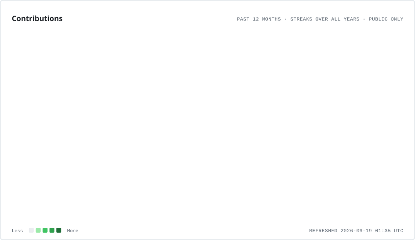
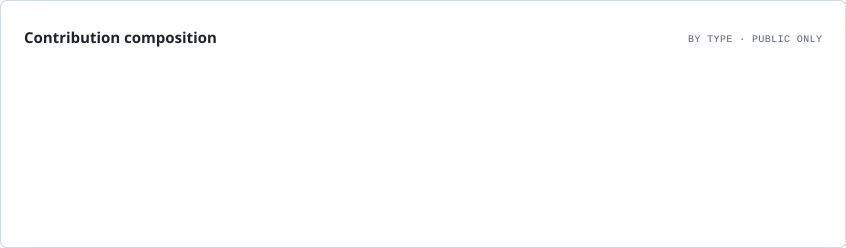
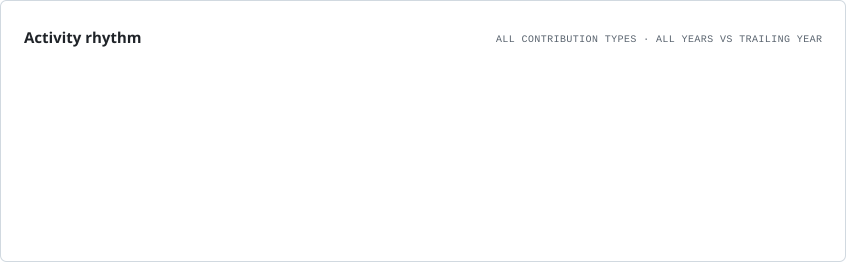
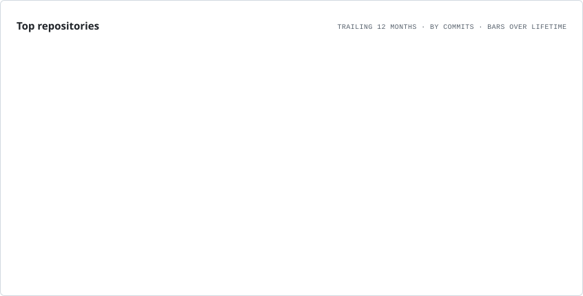
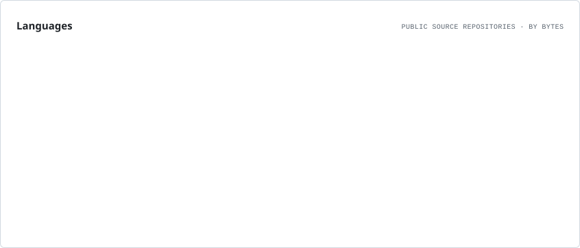

<div align="center">

# P A R I D H I          S H A R M A


<br/>

Building backend systems, distributed architectures, and AI-powered products :)

<br/>

[](https://www.linkedin.com/in/theparidhisharma/)
[](mailto:paridhi0203sharma@gmail.com)
[](https://cresia.in)
[](https://paridhisharma.in/)

</div>

## First and foremost, these are all my deployed works:

<div align="center">

<table>
<tr>
<td align="center"><a href="https://cresia.in"><b>Cresia</b></a></td>
<td align="center"><a href="https://paridhisharma.in"><b>Portfolio</b></a></td>
<td align="center"><a href="https://theparidhisharma.github.io/AutoIQ/"><b>AutoIQ</b></a></td>
</tr>
<tr>
<td align="center"><a href="https://student-portal-dnu9csdhq-paridhi-sharmaaas-projects.vercel.app/"><b>Student Portal</b></a></td>
<td align="center"><a href="https://chemistry-booster-website.vercel.app/"><b>Chemistry Booster</b></a></td>
<td align="center"><a href="https://cosmic-nexus-seven.vercel.app/"><b>Cosmic Nexus</b></a></td>
</tr>
<tr>
<td align="center"><a href="https://polaris-dun-three.vercel.app/"><b>Polaris</b></a></td>
<td align="center"><a href="https://codotion.vercel.app/"><b>Codotion</b></a></td>
<td align="center"><a href="https://crowd-flow-neon.vercel.app/"><b>Crowd Flow</b></a></td>
</tr>
</table>

</div>

## 🌸 About Me

```javascript
const paridhi = {
    role: "Software Engineer & Co-Founder @ Cresia",
    education: "B.Tech CSE @ IGDTUW '28",
    experience: ["Flipkart", "Deutsche Telekom Digital Labs"],
    
    loves: ["Distributed Systems", "Backend Engineering", "Building Products"],
    builds: ["Kafka Pipelines", "Microservices", "Event-Driven Systems"],
    
    currentFocus: "Building reliable systems and understanding them deeply",
    motto: "Elegant code, powerful systems ✨"
};
```


## Featured Projects

### [RetargetIQ](https://github.com/theparidhisharma/RetargetIQ) — Event-Driven Powerhouse


An event-driven recommendation platform built as a **10+ microservice architecture** using Apache Kafka.

**What makes it special:**

* Event-driven communication across services
* Independently deployable microservices
* Docker-based local orchestration
* Designed for high-throughput event processing
* eature extraction → Retrieval → Ranking → Recommendations

**Tech Stack:** Java • Spring Boot • Apache Kafka • MongoDB • Docker • Microservices

<br clear="right"/>

---

### [AutoIQ](https://theparidhisharma.github.io/AutoIQ/) — Intelligent Automotive Platform

An AI-powered automotive platform designed to combine vehicle intelligence, diagnostics, and user-focused workflows into a single product.

**What makes it special:**

* AI-driven product workflows
* End-to-end product ownership
* Designed from architecture to deployment
* Built independently for a competitive techathon

**Tech Stack:** Python • AI/ML • APIs • Web Technologies

<br clear="left"/>

---

### [ATS GradeIT](https://github.com/theparidhisharma) — Resume Intelligence

An AI-assisted resume evaluation system that analyzes resumes against job requirements and provides structured feedback.

**What makes it special:**

* Resume and job-description analysis
* NLP-based matching and evaluation
* Structured scoring and feedback
* Automated processing pipeline

**Tech Stack:** Python • NLP • Machine Learning • APIs

<br clear="left"/>

---


## Tech Stack

<div align="center">

### Backend Magic


### Frontend Elegance


### DevOps & Tools


</div>


## GitHub Stats

<div align="center">

<picture>
  <source media="(prefers-color-scheme: dark)" srcset="./assets/overview.dark.svg">
  
</picture>

<picture>
  <source media="(prefers-color-scheme: dark)" srcset="./assets/contributions.dark.svg">
  
</picture>

<picture>
  <source media="(prefers-color-scheme: dark)" srcset="./assets/composition.dark.svg">
  
</picture>

<picture>
  <source media="(prefers-color-scheme: dark)" srcset="./assets/rhythm.dark.svg">
  
</picture>

<picture>
  <source media="(prefers-color-scheme: dark)" srcset="./assets/repositories.dark.svg">
  
</picture>

<picture>
  <source media="(prefers-color-scheme: dark)" srcset="./assets/languages.dark.svg">
  
</picture>

</div>


## Experience

<table>
<tr>
<td width="50%" valign="top">

### Cresia

**Co-Founder & Engineer**

Building and shipping software products end-to-end, from system design and backend development to deployment and iteration.

*Learning: Production ≠ Tutorials*

[](https://cresia.in)

</td>
<td width="50%" valign="top">

### Flipkart

**Software Development Engineer Intern**

Worked on backend engineering and observability for production systems, including log analysis and log-template mining.

*Learning: Production systems demand precision*

</td>
</tr>
<tr>
<td width="50%" valign="top">

### Deutsche Telekom Digital Labs

**Backend Engineering Intern**

Worked with Java, microservices, Kafka, and distributed backend systems in an enterprise engineering environment.

*Learning: Logs matter, simplicity wins*

</td>
<td width="50%" valign="top">

### Microsoft Student Chapter — IGDTUW

**President**

Leading a technical community focused on building, learning, and creating opportunities for students through technology and industry engagement.

*Learning: Great engineering communities compound*

</td>
</tr>
</table>


## Engineering Philosophy

<div align="center">

|                    Simple > Clever                      |                 Logs > Guesses                   |         Ship Fast            |
| :-----------------------------------------------------: | :----------------------------------------------: | :--------------------------: |
| Code should be easy to understand, change, and maintain | Good observability beats debugging by assumption | Ship, learn, improve, repeat |

|                     Design for Failure                  |                Production is Truth             |                 Build Systems              |
| :-----------------------------------------------------: | :--------------------------------------------: | :----------------------------------------: |
| Services fail. Networks fail. Systems should expect it. | Real users expose what local environments hide | Build reliable systems, not isolated demos |

</div>


## 🐍 Contribution Activity

<div align="center">


</div>


## Let's Connect!

<div align="center">

Open to discussions about **System Architecture** • **Distributed Systems** • **Event-Driven Design** • **Backend Engineering** • **AI**

<br/>

### ✨ Building systems that scale, one Kafka topic at a time ✨

<br/>

</div>

---

<div align="center">

**Thanks for stopping by!** 


</div>
